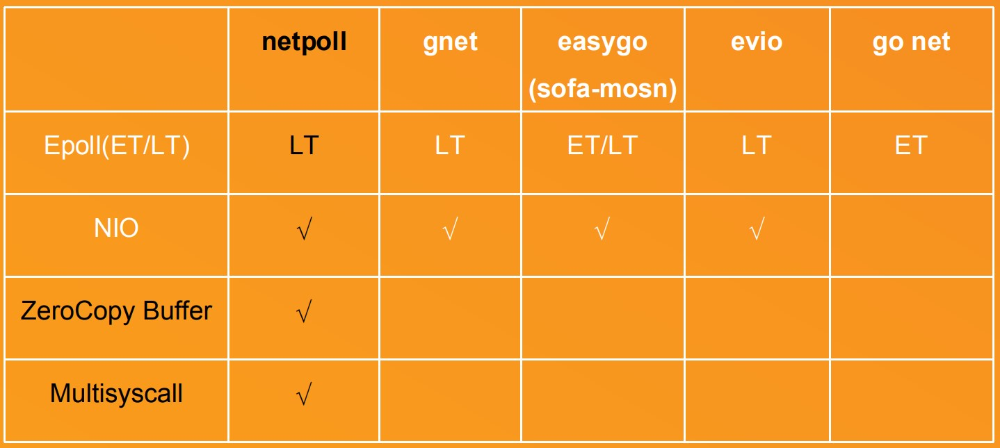
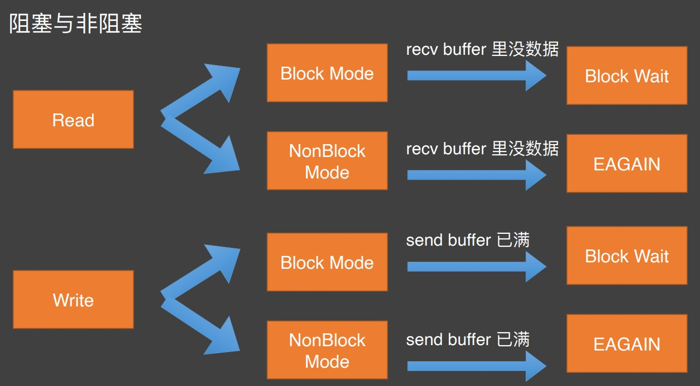
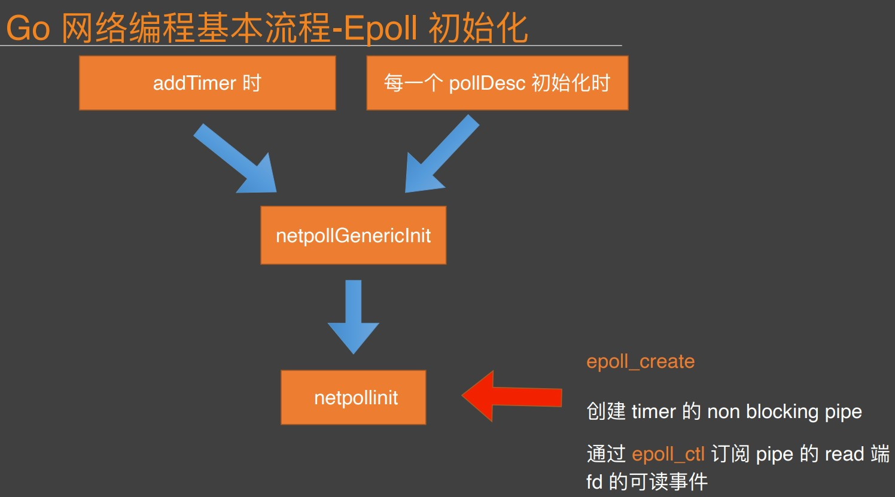
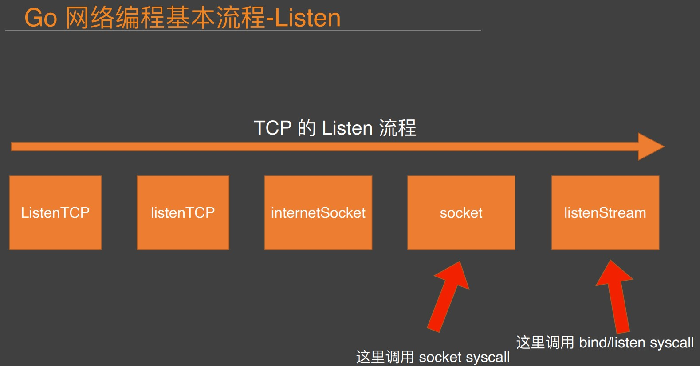
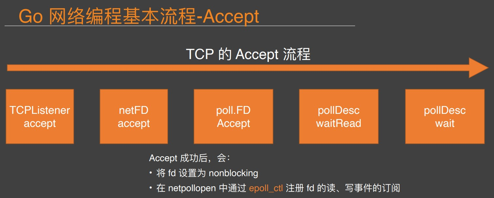
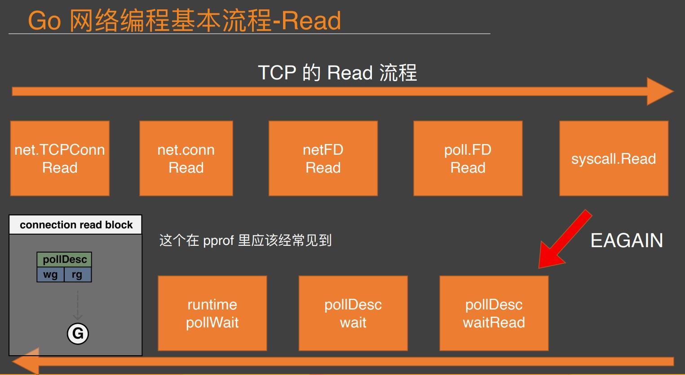
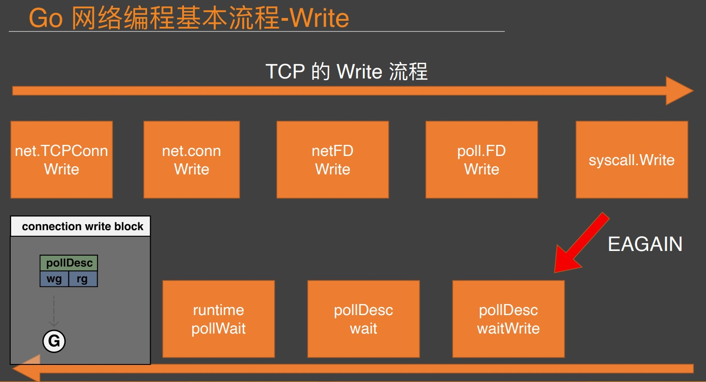

# netpoll-study

### 一些细节
* epoll_create1(EPOLL_CLOEXEC)比之epoll_create1(0)，fork出来的子进程这些pd是关闭的，[参考](https://learnku.com/articles/13580)
* epoll_pwait除了接收fd的读写事件，还能接收signalfd的信号，[参考](https://cloud.tencent.com/developer/ask/sof/223634)
* BIO和NIO的对比：[IO多路复用与Go网络库的实现](https://ninokop.github.io/2018/02/18/go-net/#non-blocking-IO)
  * BIO的缺点是在et模式下需要一个线程对一个连接；内核不停的切换线程的开销大。
  * NIO一般由少量event-dispatching线程和用户线程组成，缺点是实现复杂。
* 本人总结网络模型的两个原则：
  1. 不要让io任务阻塞了线程/协程，例如：1系统调用read设置为non-blocking，2使用自研网络库gnet、netpoll
  1. 尽早的提交io任务给io设备，例如：有了新的read事件后开启协程来处理read->decode->process->encode->write，可以改成一个协程处理read、write，一个协程处理decode->process->encode
* 关注点：
  1. Netpoll是NIO模式，net包是BIO模式：[参考](https://www.cloudwego.io/zh/docs/netpoll/overview/)
  2. Netpoll增加了连接的活性检查，net包没有：[参考](https://www.cloudwego.io/zh/docs/netpoll/overview/)
  3. NoCopy API：Netpoll有零拷贝技术
  4. LinkBuffer：多个tcp连接读写同一块内存池，减少内存分配开销
  5. 如果有栈扩张问题，使用协程池gopool：没有worker创建worker，woker执行完task后若还有task则继续执行，没有则exit
  6. tcp Nagle算法的缺点：一般要等收到足够的数据包后才ack。解决：开启TCP_NODELAY，缺点是ack包变多(但是现在网络环境好)
  7. tcp send之前先合并包：为啥不用tcp本身的合并功能？
  8. 连接多路复用：假设上游的pv是M个，每个pv需要调用N次下游，那么下游流量就是MxN(多路复用后是M)

### 字节跳动在 Go 网络库上的实践
* [字节跳动在 Go 网络库上的实践 - 公众号](https://mp.weixin.qq.com/s/wSaJYg-HqnYY4SdLA2Zzaw)
  * 采用水平触发(LT)，则需要同步的在事件触发后主动完成 I/O，并向上层代码直接提供 buffer。
  * 采用边沿触发(ET)，可选择只管理事件通知(如 go net 设计)，由上层代码完成 I/O 并管理 buffer。
  * （netpoll 采用前者策略，主动 I/O 可以集中内存使用和管理，提供 nocopy 操作并减少 GC。）
* [字节跳动在 Go 网络库上的实践 - ppt](images/byte_dance.pdf)



### 高性能 NIO 网络库 Netpoll-开源说
* [高性能 NIO 网络库 Netpoll-开源说](https://www.bilibili.com/video/BV17U4y1K7TC)
* If you can't measure it, you can't improve it.
* Netpoll为什么去掉了 TCP 的合并包却自己实现合并？

### Go 原生同步网络模型解析-Go夜读
* [Go 原生同步网络模型解析-Go夜读](https://www.bilibili.com/video/BV13E411B721)
* 介绍了gnet框架的设计

```
netFD    // net包的网络描述符
pollDesc // 运行时的一个poller的描述符

// 运行时网络轮询器的接口
func netpollinit()
func netpollopen(fd uintptr, pd *pollDesc) int32
func netpoll(delta int64) gList
 
// 运行时网络轮询器在linux下的底层系统调用
int epoll_create1(int flags);
int epoll_ctl(int epfd, int op, int fd, struct epoll_event *event);
int epoll_pwait(int epfd, struct epoll_event *events, int maxevents, int timeout, const sigset_t *sigmask);
```

### 实例浅析epoll的LT和ET模式，ET模式为何要使用非阻塞IO
* [实例浅析epoll的LT和ET模式，ET模式为何要使用非阻塞IO](https://learnku.com/articles/51861)

```
epool的lt是只要事件没有被处理就一直触发，et则只触发一次，导致et必须每次要循环处理完所有的事件，六个测试场景如下：

1. sockfd是lt模式+非阻塞：能正常accept所有请求
2. sockfd是et模式+非阻塞：会漏处理accept一些请求，因为每次epoll_wait返回时只处理了一个请求
3. connfd是lt模式+阻塞：能正常处理所有连接的read
4. connfd是lt模式+非阻塞：能正常处理所有连接的read
5. connfd是et模式+阻塞：如果epoll_wait返回时只处理一次read，那么数据可能没有读完；如果循环处理read，当没有读事件时会阻塞线程。
6. connfd是et模式+非阻塞：如果epoll_wait返回时只处理一次read，那么数据可能没有读完；如果循环处理read，能正常处理所有连接的read
```

### Netpoll 模型的抽象和问题-曹大
* [Netpoll 模型的抽象和问题-曹大](https://www.bilibili.com/video/BV1Lt4y1h7Zu)
* pull.FD的Read和Write方法是有锁的，保证同一时间只有一个协程读或者写，[见源码](https://github.com/golang/go/blob/go1.16.10/src/internal/poll/fd_unix.go#L142)
* 社区的netpoll的努力：改变Go的1个连接1个协程，在有读事件的时候才开启协程








