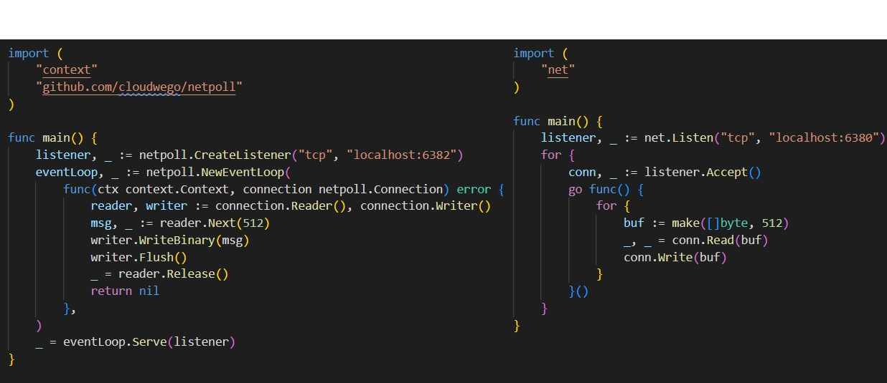
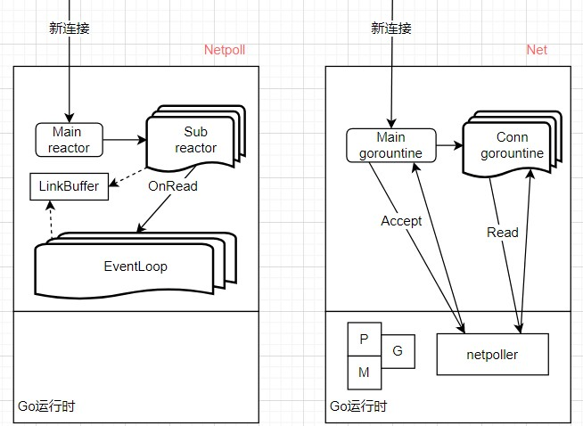

# 
# 
# 
# 字节跳动Netpoll网络包
官方网站：https://www.cloudwego.io/zh/docs/netpoll/

---
# 内容目录
* Netpoll包和net包的对比
* 特点1：业务层使用时的零拷贝
* 特点2：读写socket的优化
* LinkBuffer的设计

---
# Netpoll包和net包的对比


---
问题：

8核，1000个连接，50%空闲，两个方案当前使用的协程数是多少？



---
# 特点1：业务层使用时的零拷贝

```go
// Netpoll
func (b *LinkBuffer) Next(n int) (p []byte, err error)

// net
func (c *TCPConn) Read(b []byte) (int, error)

// 由于传参是切片，read调用时内核会拷贝数据到此切片处
// 假设要读取固定512字节，内核可能拷贝多，也可能拷贝少
// 所以不可避免的需要在业务层进行内存的重组（拷贝）
// https://www.cloudwego.io/zh/docs/netpoll/getting-started/#32-高阶用法
```

---
# 特点2：读写socket的优化之readv，writev
```c
ssize_t read(int fd, void *buf, size_t count);
ssize_t write(int fd, const void *buf, size_t count);


char *str0, *str1 = malloc(5), malloc(5);
struct iovec iov[2];
iov[0].iov_base = str0;
iov[0].iov_len = strlen(str0);
iov[1].iov_base = str1;
iov[1].iov_len = strlen(str1);
ssize_t rn = readv(STDIN_FILENO, iov, 2);
ssize_t wn = writev(STDOUT_FILENO, iov, 2);
```

---
# 特点2：读写socket的优化之零拷贝
