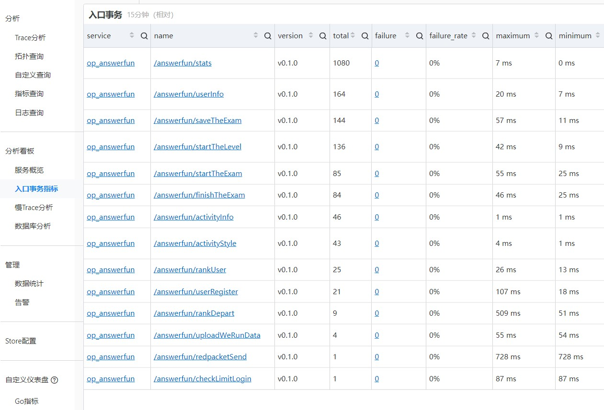
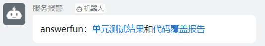
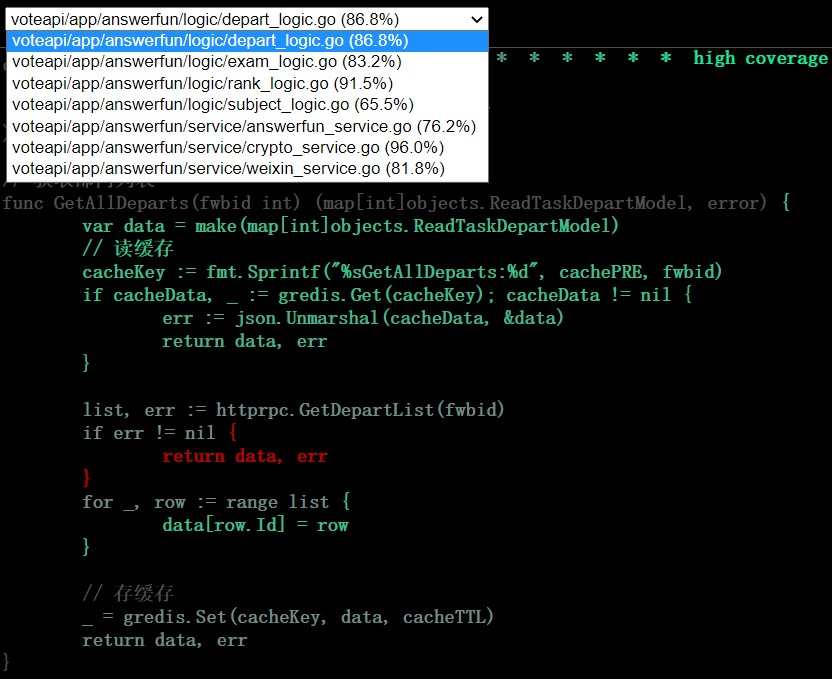

<!-- _class: center -->
# 2022年终工作总结
陈兴

---
# 内容目录
* 主要工作内容
* 做得好的方面
* 做得不好的方面
* 2023新年规划

---
# 主要工作内容
1. **常规答题：** 答题用时精确到毫秒；排行榜增加每日最佳成绩的累计；根据小程序的新规调整获取手机号的流程；创建活动不再依赖微刊实例
2. **趣味答题：** 增加微信红包；增加转盘抽奖；关卡页自定义样式；答错提前退出；一战到底逻辑；增加诗词答题
3. **元宇宙相关：** 虚拟空间2.0的答题活动；虚拟助手的答题活动；UnrealEngine应用的反向代理
4. **其他项目：** 通用的内容审核api；微信管理平台的自助隐私设置和权限申请；二机总活动平台的答题模块
5. **维护工作：** 链路跟踪换成阿里云sls-trace；趣味答题的自动化测试；dt4_user_result表历史数据迁移

---
# 做得好的方面
1. 链路跟踪从skywalking换成阿里云sls-trace  好处：更省钱、更稳定、无需运维

---
<!-- _backgroundColor: white -->

---
# 做得好的方面
2. 基于gitlab-ci的自动化测试  

---
<!-- _backgroundColor: black -->

---
# 做得不好的方面
1. 题目类型增加诗词类型，导致多选题答案错误 总结：没有做好充分的自测

2. 银川市共青团的答题，单日pv有1200万，导致数据库负载过高和接口超时 总结：没有提前做压测和sql优化；服务报警不及时

---
# 2023新年规划
1. 保证所负责项目的稳定运行和需求迭代；
2. 提高测试覆盖率，学习一些压测的工具，项目多做压测；
3. 入门深度学习，入门语音相关技术，看完《线性代数》和《概率论与数理统计》。

---
<!-- _class: center -->
# 谢谢大家
