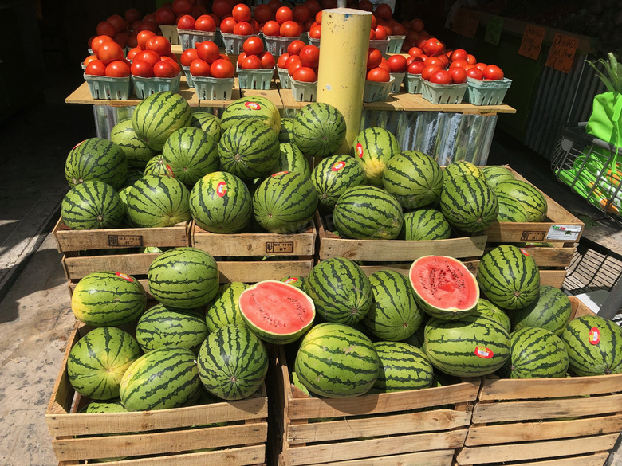
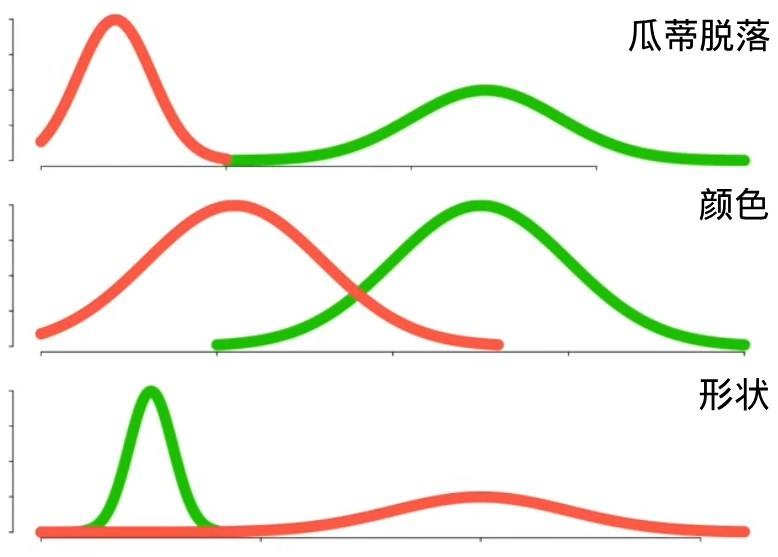
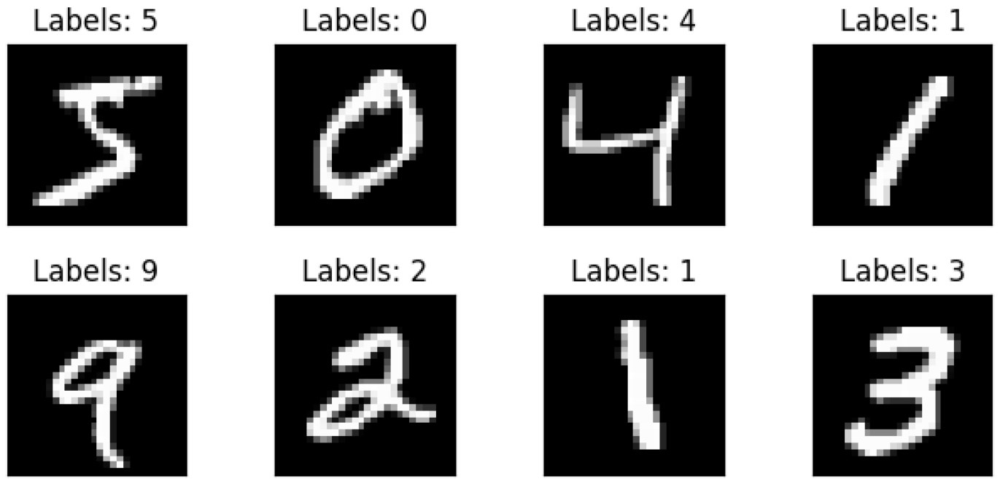

<!-- _class: center -->
# 朴素贝叶斯分类

---
# 内容目录
* 买西瓜的例子
* 朴素贝叶斯分类
* 伯努利分布和高斯分布
* 手写数字识别

---
# 买西瓜的例子
如何鉴别西瓜熟了？
- 先验概率：瓜摊上60%的瓜都是熟瓜
- 后验概率：瓜蒂脱落的瓜就是熟瓜



---
求后验概率：
```
P(瓜熟|瓜蒂脱落) = P(瓜熟) * P(瓜蒂脱落|瓜熟) / P(瓜蒂脱落)
```

根据以往的买瓜经验：
```
P(瓜熟)=0.6
P(瓜蒂脱落|瓜熟)=0.8
P(瓜蒂脱落)=0.64
```

可得：
```
P(瓜熟|瓜蒂脱落) = 0.6*0.8 / 0.64 = 0.75
```

---
通过3个特征来判断西瓜熟了
|瓜蒂脱落|颜色|形状|结果|
|---|---|---|---|
|是|浅绿|圆|__瓜熟__|
|否|深绿|尖|_瓜生_|
|...|

<br/>
给定一个向量X(包含3个特征)，分别求出：

```
P(瓜熟|X) = P(瓜熟) * P(X|瓜熟) / P(X)
P(瓜生|X) = P(瓜生) * P(X|瓜生) / P(X)
```

---
根据以往的买瓜经验：
```
P(瓜蒂脱落|瓜熟)=2/3        P(瓜蒂脱落|瓜生)=0.25
P(浅绿|瓜熟)=1/3　　        P(浅绿|瓜生)=0.25
P(圆形|瓜熟)=2/3　　        P(圆形|瓜生)=0.25
```

可得：
```
P(瓜熟|X) = 0.6 * 2/3 * 1/3 * 2/3 = 4/45
P(瓜生|X) = 0.4 * 0.25 * 0.25 * 0.25 = 1/160 
```

---
# 朴素贝叶斯分类
### 贝叶斯公式
$P(Y|X) = \frac{P(Y) * P(X|Y)}{P(X)}$

### 朴素贝叶斯分类
$P(Y=c_k|X=x) = \frac{P(Y=c_k) * P(X=x|Y=c_k)}{P(X=x)}$

$y = arg \max\limits_{c_k} \frac{P(Y=c_k) * P(X=x|Y=c_k)}{P(X=x)}$

$\ \, = arg \max\limits_{c_k} P(Y=c_k) * P(X=x|Y=c_k)$
$\ \, = arg \max\limits_{c_k} P(Y=c_k) * \prod\limits_{j=1}^nP(X^{(j)}=x^{(j)}|Y=c_k)$

---
# 伯努利分布和高斯分布
### 伯努利分布
$$
\begin{flalign}
\qquad \quad \ \ \ p_{X}(x) = \begin{cases} 
p,  & \text{若x=1} \\
1-p, & \text{若x=0}  \end{cases} &&
\end{flalign}
$$

### 高斯分布
$\qquad\;\;\;\;\; f_X(x) = \frac{1}{\sqrt{2\piσ^2}}e^{-(x-μ)^2/(2σ^2)}$

---
<style>

</style>
3个特征的特征值变成0~255
|瓜蒂脱落|颜色|形状|结果|
|---|---|---|---|
|251|1|240|__瓜熟__|
|3|155|16|_瓜生_|
|...|

<br/>
P(瓜熟|X) = 0.6 * 0.06 * 0.04 * 0.01
P(瓜生|X) = 0.4 * 0.03 * 0.11 * 0.02



---
如何求解高斯分布函数？

$f_X(x) = \frac{1}{\sqrt{2\piσ^2}}e^{-(x-μ)^2/(2σ^2)}$

其中：
$μ$是特征的均值$E[X]$
$σ^2$是特征的方差$var(X) = E[(X - E[X])^2]$

---
# 手写数字识别
_28x28像素的手写数字图片和对应的数字，训练集60000张，测试集10000张_



---
伯努利分布法：像素是否有色值
|0|1|2|...|783|结果|
|---|---|---|---|---|---|
|有|无|有|...|有|__4__|
|无|无|有|...|有|__1__|
|...|

高斯分布法：像素的灰度值0~255
|0|1|2|...|783|结果|
|---|---|---|---|---|---|
|0|218|0|...|0|__4__|
|0|52|195|...|163|__1__|
|...|

---
参考视频：[伯努利分布](https://www.bilibili.com/video/BV1tG411a7gn/)、[高斯分布](https://www.bilibili.com/video/BV1yb4y1279i/)
代码地址：[伯努利分布](https://colab.research.google.com/drive/1XqoIUZ0BmVurL-RS306FKPIju-t8_9V-?usp=sharing)、[高斯分布](https://colab.research.google.com/drive/1RsmhlBGVkAH3KWA-ES1hsVWmcPUlWC5A?usp=sharing)
代码结果：
- 伯努利分布法的准确率：84%
- 高斯分布法的准确率：56%

注意事项：
1. 朴素贝叶斯分类假设各个特征之间概率彼此独立，但实际上并不是
1. 使用概率统计的时候，遇到分母为0情况可以用拉普拉斯平滑
1. 使用高斯分布法求特征的概率，概率太小会损失精度，需用对数似然函数

---
<!-- _class: center -->
# Thanks
