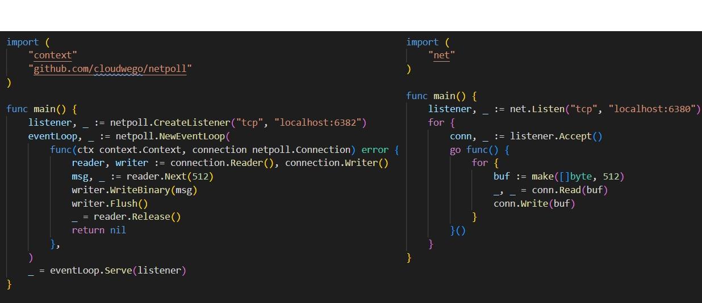

<!-- _class: center -->
# 字节跳动的Netpoll网络包

---
|  | netpoll | gnet | evio | go net |
|--|--|--|--|--|
|Epoll(ET/LT) |LT |LT | LT | ET |
|NIO          |✓|✓|✓| |
|ZeroCopy Buffer|✓||||
|Multisyscall   |✓||||

(GopherChina 2021 的分享：字节跳动在 Go 网络库上的实践)

---
# 内容目录
* Netpoll包和net包的对比
* 特点1：业务层使用时的零拷贝
* 特点2：读写socket的优化
* LinkBuffer的设计

---
# Netpoll包和net包的对比


---
问题：

8核，1000个连接，50%空闲，两个方案当前使用的协程数是多少？


---
# 特点1：业务层使用时的零拷贝

```go
// Netpoll
func (b *LinkBuffer) Next(n int) (p []byte, err error)

// net
func (c *TCPConn) Read(b []byte) (int, error)

// 由于传参是切片，read调用时内核会拷贝数据到此切片处
// 假设要读取固定512字节，内核可能拷贝多，也可能拷贝少
// 所以不可避免的需要在业务层进行内存的重组（拷贝）
// https://www.cloudwego.io/zh/docs/netpoll/getting-started/#32-高阶用法
```

---
# 特点2：读写socket的优化（readv，writev）
```c
ssize_t read(int fd, void *buf, size_t count);
ssize_t write(int fd, void *buf, size_t count);

ssize_t readv(int fd, const struct iovec *iov, int iovcnt);  // 顺序填入每个缓冲区
ssize_t writev(int fd, const struct iovec *iov, int iovcnt); // 顺序读取每个缓冲区再写

char *str0, *str1 = malloc(5), malloc(5);
struct iovec iov[2];
iov[0].iov_base = str0;
iov[0].iov_len = strlen(str0);
iov[1].iov_base = str1;
iov[1].iov_len = strlen(str1);
ssize_t rn = readv(STDIN_FILENO, iov, 2);
ssize_t wn = writev(STDOUT_FILENO, iov, 2);
```

---
# 特点2：读写socket的优化（零拷贝）

```c
// msghdr中包含iovec、iovcnt；flags可设置MSG_ZEROCOPY
ssize_t sendmsg(int sockfd, struct msghdr *msg, int flags);
ssize_t recvmsg(int sockfd, struct msghdr *msg, int flags);
```
1. 内核4.14开始支持TCP，5.0之后才支持UDP
1. 只适用于大文件(10KB左右)的场景，小文件场景因为page pinning页锁定和等待缓冲区释放的通知消息这些机制，甚至可能比直接CPU拷贝更耗时
1. 需要额外调用poll()和recvmsg()系统调用等待buffer被释放的通知消息
1. 内核5.4才支持recv

---
# LinkBuffer的设计


---
<!-- _class: center -->
# Thanks
